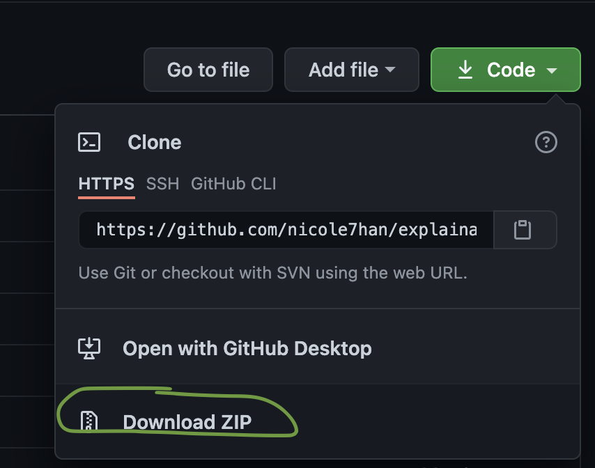
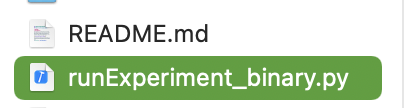
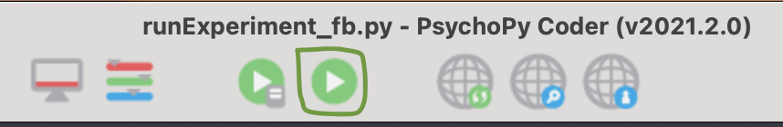
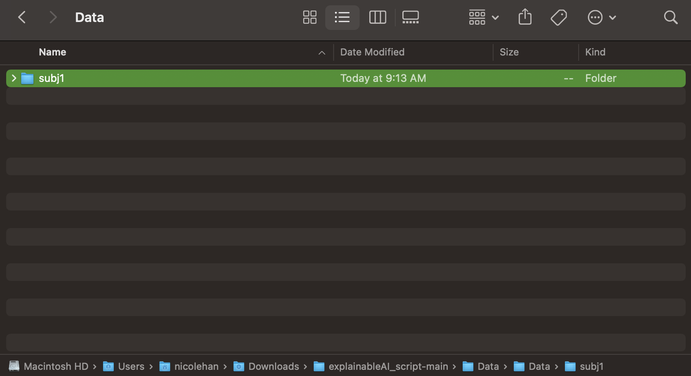

# explainableAI_script

Intructions for research assistants in the VIU lab to run psychopy experiment.

## Set up
1. download and install psychopy3: from:https://www.psychopy.org/download.html

2. download this github file by clicking "code" -> "download zip"

3. unzip the file and move the folder "explainableAI_script-main" to a directory on your computer.

## Run the experiment
1. open psychopy3, there will be multiple windows opening up, make sure you use the window with "Psychopy Coder".

2. click "file" -> "open", select the file "runExperiment_binary.py", click "open"

3. once you open the file, click "run experiment" button on the top

4. Put in your subject name, select age and gender to start. Repeat this process for 6 times and make sure you always put the exact same subject name (e.g., "1") each time.

## Upload your data
1. go to the folder Data/Data/
2. find the folder name with your subject id/name 

4. zip the file and upload zip file to google drive: https://drive.google.com/drive/folders/1pIHzftLmrqEmYD4P1dDDuoA2RNAZqN1V?usp=sharing
